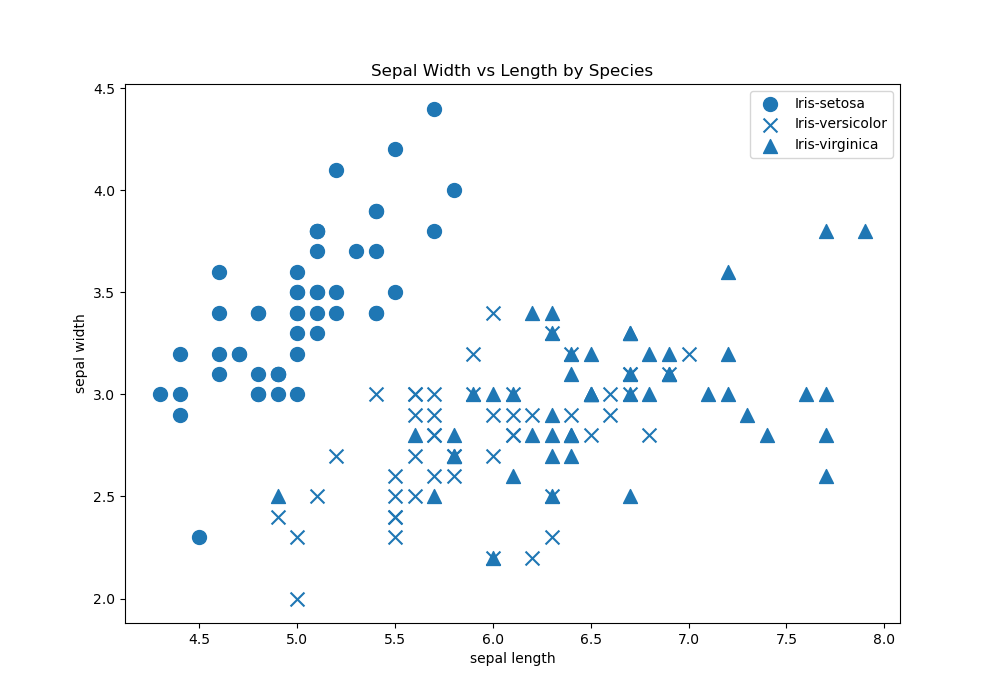
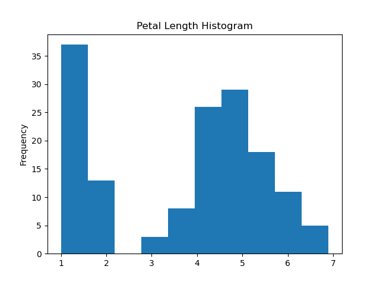
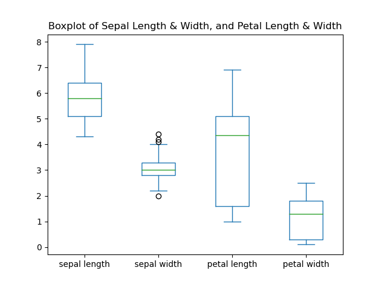

# EDA and Preprocessing of Iris Data

To teach myself some basic EDA I've looked at the [Iris dataset from UCI](https://archive.ics.uci.edu/ml/datasets/iris).

## EDA
### Initial information gathering
First I looked at the data info and description using pandas' dataframe object, then I tried indexing into the dataframe and could split it into two dataframes, with sepal length less than or greater than 5 and printed the describtion of those datadrames.

### Plotting
I plotted the different classes as a function of their sepal width and length, this plot is shown here: 

I saw in that plot that the iris-setosa species in general has a lower sepal length and higher sepal width, the iris-virginica seems to have a longer sepal length and a thinne sepal width and the iris-versicolor seems to also share those features though with a shorter sepal length.

Then I created a petal length histogram as seen here: 

In that diagram it seems that the petal lengths between 3 and 7 seems to follow a binomial distribution. But there are also a lot within length 1 and 2. This might be a different species of iris flowers.

Finally I created a boxplot diagram of the sepal- and petal-, length and width. 

In this I could see the variance of the features, where it seems the petal length has the largest variance and the sepal width the smallest variance.

### EDA Conclussion
I have found some interesting information about the different features in the dataset and could use that information to look into classification of the different species based on those features.

## Preprocessing
I first found the missing values of the dataframe and there wasn't any. So I decided to delete some to figure out how to handle this case. I deleted the sepal length feature from 10 random rows and again tried to find the missing values. This time they obviously came up with 10 missing values for the sepal length feature. There are multiple ways to deal with that, one way is to just delete all the rows where the missing data are, this might work okay if there are not too many of such rows compared to the size of the dataset. Another way is to fill the missing values with the mean values of the other rows. I could also, using a ML model, try to find those values using the other features.

### Preprocessing Conclission
I think I got a good feel for figuring out how to identify missing values and what methods I can use to address that.