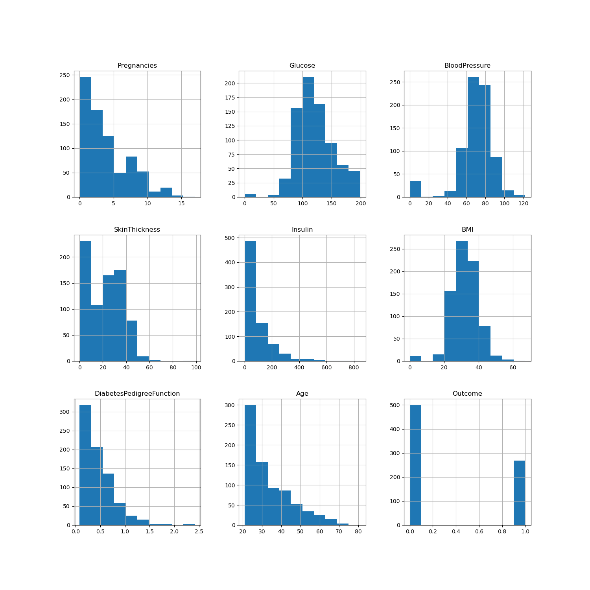

# Predicting Diabetes with MLP

## Dataset
The dataset that I will be using for this MLP comes from the Pima Indians Diabetes dataset. This dataset has been made available by the National Instiute of Diabetes and Digestive and Kidney Diseases for hosting on kaggle.com. The dataset contains 768 observations and 9 variables. The variables are as follows:
- Pregnancies: Number of times pregnant
- Glucose: Plasma glucose concentration a 2 hours in an oral glucose tolerance test
- BloodPressure: Diastolic blood pressure (mm Hg)
- SkinThickness: Triceps skin fold thickness (mm)
- Insulin: 2-Hour serum insulin (mu U/ml) 
- BMI: Body mass index (weight in kg/(height in m)^2)
- DiabetesPedigreeFunction: Diabetes pedigree function
- Age: Age (years)
- Outcome: Class variable (0 or 1)
An important note is that the Pima Indians is a population that is at high risk for diabetes. This means that the dataset is not representative of the general population. The dataset is available on [kaggle.com](https://www.kaggle.com/uciml/pima-indians-diabetes-database).

## EDA
First I simply look at the first 10 rows of the dataset to get a feel for what features are present and how they are represented.
```python
df.head(10)
```
I can see that the dataset has 768 observations, 8 feature variables and 1 outcome variable. I can also see already that there are potentially missing values for some of the features. I can also see that the features are very different in scale. This is a problem as features with high numerical values can become dominant in a model. To get a better view of the entire dataset I use the histogram function to plot the distribution of each feature.
```python
df.hist(figsize=(10,10))
plt.show()
```


This histogram seems to confirm our initial suspicions that there might be missing values in the dataset as several features have a high frequency for the value 0. I can also confirm that different features are very different in terms of scale. I will have to address both these issues. Looking at the histogram I can also see that there are some potential outliers.
### Pregnancies
I will start by looking at the pregnancies feature. It looks like the dataset is believeable as the number of pregnancies is a discrete variable and the distribution of the values is reasonable, except for a few outliers. I will leave the outliers in the dataset for now.
### Glucose
The glucose feature seems to follow a normal distribution, which seems reasonable. There are some zero values, which definitely must be missing values. I will need to replace those
### BloodPressure
The blood pressure feature also seems to follow a normal distribution, which seems reasonable. There are some zero values, which definitely must be missing values. I will need to replace those
### SkinThickness
Looking at the skin thickness feature I can see that there are a lot of zero values. This is definitely a problem as it means that there are a lot of missing values. I will need to replace those. There are also some outliers that seem to be unrealistic. I will leave those in the dataset for now.
### Insulin
There are a lot of zero values in the insulin feature. This is definitely a problem as it means that there are a lot of missing values. I will need to replace those. There are also some outliers that seem to be unrealistic. I will leave those in the dataset for now.
### BMI
The BMI feature seems to follow a normal distribution, which seems reasonable. There are some zero values, which definitely must be missing values. I will need to replace those
### DiabetesPedigreeFunction
The DiabetesPedigreeFunction feature seems to follow a normal distribution, which seems reasonable. There are some zero values, which definitely must be missing values. I will need to replace those
### Age
I can see that there are in general more younger people in the dataset, this could be due to the fact that the dataset is from a population that is at high risk for diabetes. The distribution of the values seems reasonable.
### Outcome
The outcome feature is a binary variable that indicates whether a person has diabetes or not. I can see that there are a more people in the dataset that do not have diabetes than people that do have diabetes, but there still seem to be a high number of people that do have diabetes compared to the general population (WHO estimates that 8.5% of the world population suffers from diabetes). This could be due to the fact that the dataset is from a population that is at high risk for diabetes.

